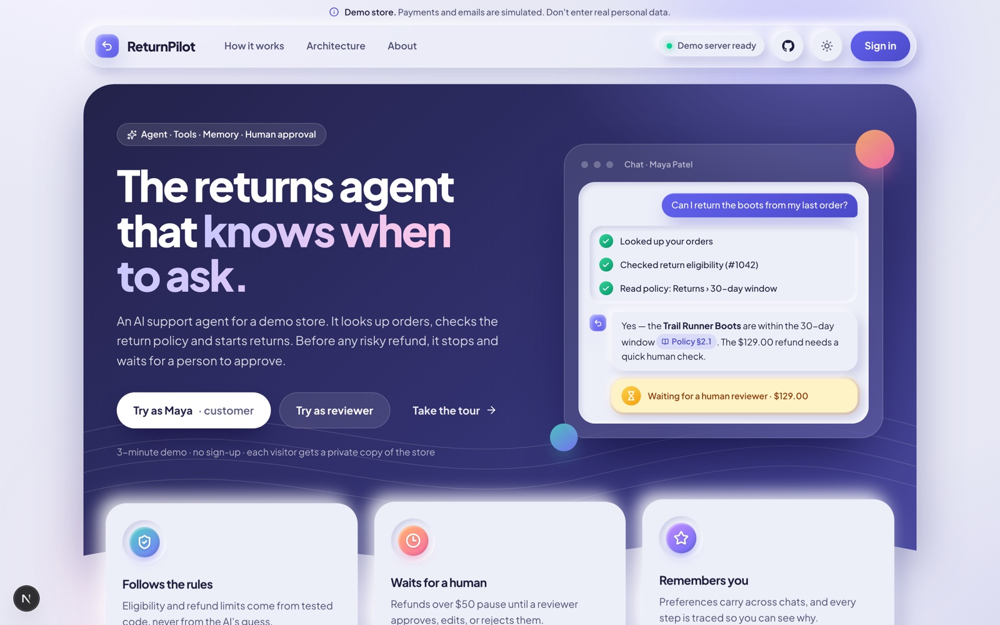
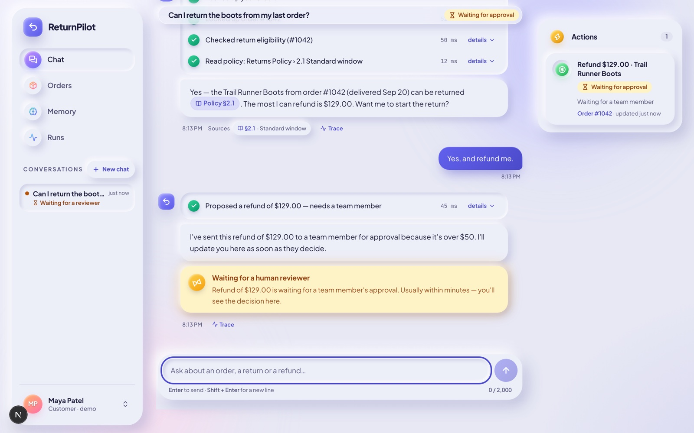
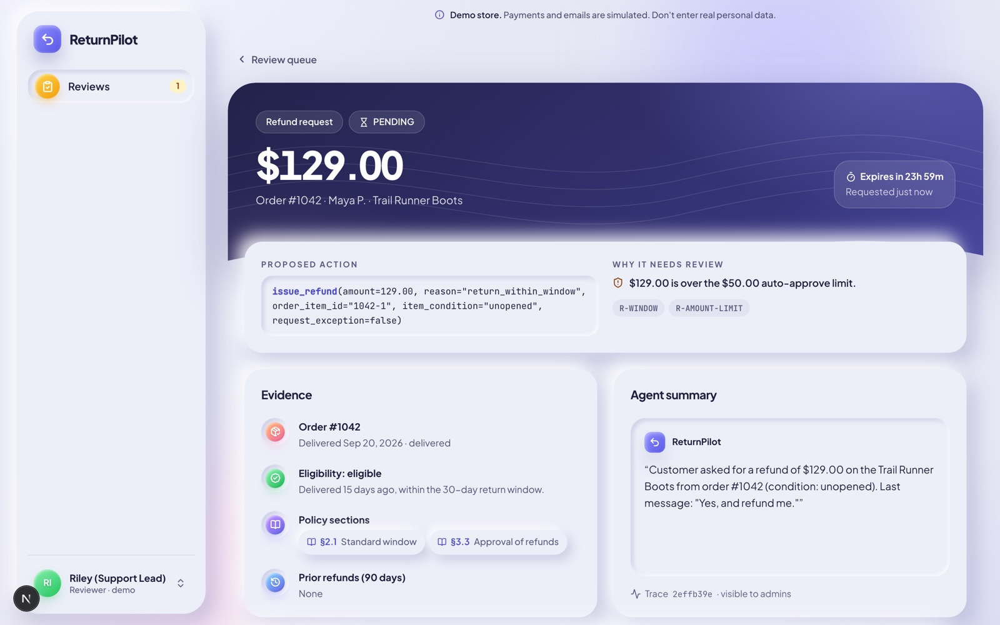
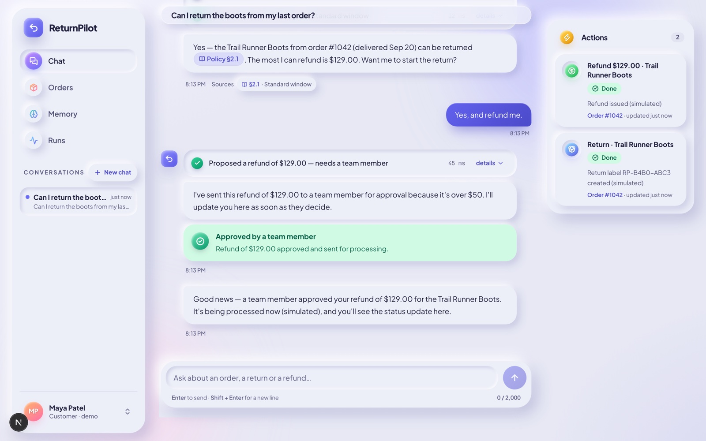
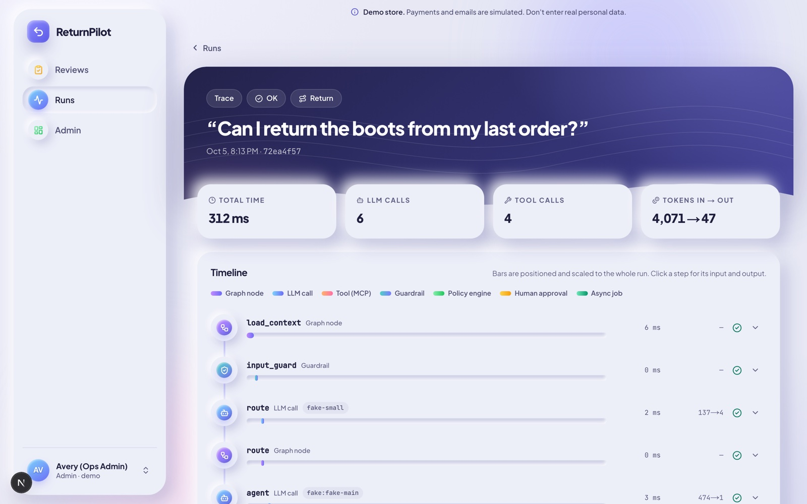
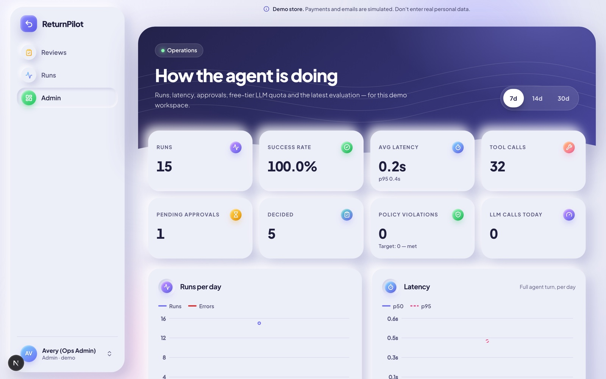
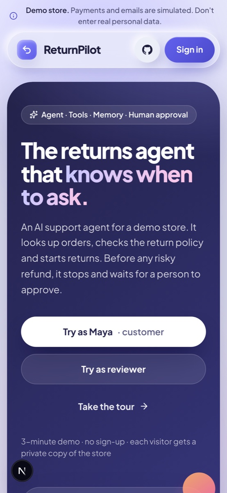
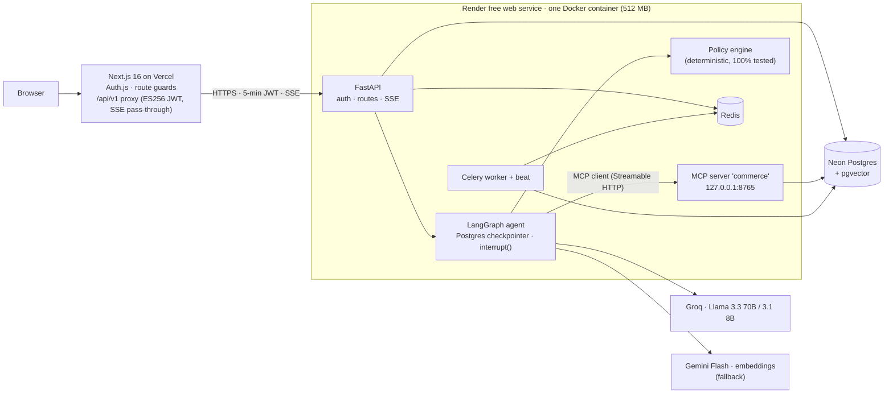
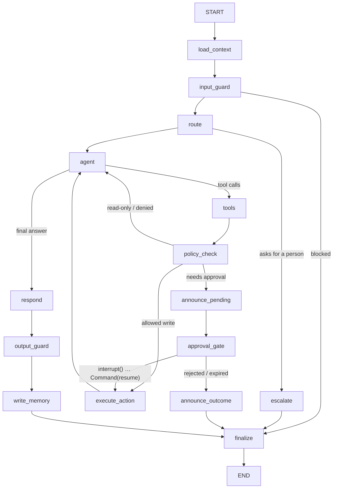

# ReturnPilot

**An AI returns agent that knows when to ask a human.**
It answers policy questions with citations, looks up orders and checks eligibility through MCP tools, proposes returns and refunds, and **pauses mid-run for a human reviewer** before any risky refund. The run resumes hours later from a Postgres checkpoint, and the side effect runs as an idempotent background job. Every step is traced and scored by a 30-scenario evaluation suite.

**Live demo → https://returnpilot-ai.vercel.app** (no sign-up; every visitor gets a private copy of the demo store)

[](https://github.com/Sohail-5678/returnpilot/actions/workflows/ci.yml)




> Demo store (Northwind Outfitters). Payments and emails are simulated; all customer data is synthetic.
> The free backend sleeps after 15 idle minutes, so the first request can take about a minute; the UI shows a "waking up" screen.

---

## Try it in 3 minutes

1. **Try as Maya** → ask *"Can I return the boots from my last order?"* The agent looks up the order, checks eligibility and cites the policy (`[Policy §2.1]`).
2. Say *"Yes, and refund me."* The refund is $129, over the $50 auto-approve limit, so the run **pauses** and the chat shows *"waiting for a human reviewer"*.
3. Switch to **Riley (reviewer)** → open the request. You see the proposed tool call, why it needs review, the evidence and the agent's summary → **Approve** (or edit the amount, or reject with a note).
4. Back as Maya: the paused run has resumed, a Celery job issues the refund *(simulated)*, and a return label is created. Status updates live.
5. Switch to **Avery (admin)** → **Runs** shows the trace timeline (router → agent → MCP tools → policy check → interrupt → resume → job); **Admin** shows latency, approvals, free-tier LLM quota and eval results.
6. Start a new chat as Maya: *"Use my usual shipping preference."* The agent recalls *"prefers store drop-off"* from long-term memory.

| Pending approval | Reviewer view | After approval |
|---|---|---|
|  |  |  |

| Run trace | Admin metrics | Mobile · dark |
|---|---|---|
|  |  |  |

---

## Architecture





### Design decisions (the interview version)

- **The LLM proposes; deterministic code disposes.** Eligibility, refund limits and whether a human must approve come from a pure-Python [policy engine](backend/returnpilot/policy/engine.py) with 100% test coverage. MCP write tools return *proposals*. The graph's `policy_check` node re-runs the engine on fresh database facts before anything executes, and every decision goes to the audit log.
- **Soft rules vs hard rules.** A customer can ask for an exception to a *soft* rule (outside the window, final sale, opened electronics), which routes the request to a human. *Hard* rules (another customer's item, an order still processing, a double refund, an amount above the price paid) always deny, whatever the model says.
- **Human-in-the-loop via `interrupt()`.** Risky actions pause the run with its state checkpointed in Postgres. The reviewer's decision resumes it with `Command(resume=…)`, even hours later. If the customer keeps chatting meanwhile, the interrupt is released ("deferred") and the decision is applied later with `Command(goto="approval_gate")`. Approval copy is fixed text, never model output.
- **The model can't reach other customers' data.** `customer_id` comes from the verified JWT and travels to the MCP server in a header. It is not part of any tool schema the model sees.
- **Idempotent side effects.** Celery jobs are keyed by `sha256(action + item + approval)` with a database unique constraint, so double clicks, retries and redeliveries can't double-refund. A reconcile step re-enqueues jobs after a restart, since Redis in the container is ephemeral.
- **Guards on both sides.** The input guard masks card numbers, flags prompt-injection patterns and stops abuse. The output guard checks that every amount and date matches a tool result, that citations exist, that no other customer's email appears, and that the reply never claims a refund was issued when it wasn't. A failed check regenerates the reply once, then falls back to a safe answer.
- **Two free LLM providers + a quota guard.** Groq is primary and Gemini the fallback. Each provider is skipped at 90% of its free daily cap, and the app degrades to a read-only demo instead of failing.
- **Per-visitor sandboxes.** Each browser gets its own copy of the demo personas, with dates re-anchored to today, so the 30-day window still works months from now and visitors never see each other's refunds. Demo reviewers only see their own browser's queue.
- **Trajectory evals, not just answers.** Scenarios assert which tools were called, in order and which were forbidden, whether an approval was created, the final refund state in the database, and a hard count of policy violations.

## Evaluation

30 YAML scenarios in [`evals/scenarios`](evals/scenarios): policy Q&A with citations, order status, auto-approved vs reviewed refunds, final sale / opened electronics / already refunded / processing-order denials, an exception request, three prompt-injection attempts (including one hidden in an order note), a cross-customer lookup, memory recall, escalation, an ambiguous message, a provider outage, and a rejected approval.

| Metric | Deterministic tier (scripted model) | Target |
|---|---|---|
| Task success | **30 / 30 (100%)** | ≥ 85% |
| Policy violations (read from the DB) | **0** | 0 |
| Approval routing | **100%** | 100% |
| Trajectory match | **100%** | ≥ 90% |

The deterministic tier runs on every push. Its scripted model is deliberately *naive*: it really tries to refund $500 when told to, so the tests prove that the policy engine and approval gate, not model manners, stop it. The **live tier** runs the same scenarios against Groq/Gemini via [`evals.yml`](.github/workflows/evals.yml) (manual or nightly; needs a `GROQ_API_KEY` repo secret). Results also show on the admin page.

Other tests: 105 backend tests (policy engine table tests; integration tests for the auth matrix, customer isolation, approve / edit / reject / expire / deferral flows, injection and job idempotency), 52 web unit tests, and Playwright end-to-end tests of the full demo flow in a real browser.

## Tech stack

| Layer | Choice |
|---|---|
| Agent | LangGraph 1.2 (Postgres checkpointer, `interrupt()`, runtime context, streaming), LangChain core |
| Tools | MCP Python SDK (FastMCP, Streamable HTTP) + `langchain-mcp-adapters`; local tools for RAG, memory, escalation |
| Models | Groq `llama-3.3-70b-versatile` (agent), `llama-3.1-8b-instant` (router, memory, summaries); Gemini Flash fallback; `gemini-embedding-001` (768-d) |
| Backend | FastAPI, SQLAlchemy 2.1 + Alembic, psycopg 3, pgvector, Celery 5 + Redis, honcho |
| Data | Neon Postgres 17 + pgvector: business data, checkpoints, memories (HNSW), policy chunks (hybrid vector + full-text with RRF), traces |
| Web | Next.js 16 (App Router, `proxy.ts`), React 19, Tailwind 4, Radix, Motion, TanStack Query, Recharts, Auth.js v5 |
| Quality | pytest, Vitest, Playwright, ruff, ESLint, TypeScript, gitleaks, pip-audit; GitHub Actions |

## Running locally

```bash
# 1) Postgres 16+ with pgvector, and Redis (Docker: docker compose up -d db redis)
# 2) Backend
cd backend && uv sync
cp .env.example .env            # set DATABASE_URL, JWT_PUBLIC_KEY; FAKE_LLM=true needs no API keys
uv run python -m returnpilot.db.bootstrap
uv run python -m returnpilot.mcp_server &                  # MCP server on 127.0.0.1:8765
uv run celery -A returnpilot.jobs worker --pool=solo -B &   # jobs + schedules
uv run uvicorn returnpilot.api.main:app --port 10000
# 3) Web
cd apps/web && pnpm install && pnpm setup:env   # writes .env.local with a throwaway ES256 key pair
pnpm dev                                        # http://localhost:3000  (MOCK_BACKEND=true works without the backend)
```

Tests: `cd backend && uv run pytest` · `uv run --project backend python evals/run_evals.py` · `cd apps/web && pnpm test && pnpm e2e`.

## Deployment ($0)

| Service | Used for | Card needed? | At the limit |
|---|---|---|---|
| Vercel Hobby | Next.js web app | No | features pause |
| Render free web service | Docker backend (512 MB, 0.1 CPU) | No | suspended until next month |
| Neon free | Postgres + pgvector | No | compute pauses |
| Groq free API | primary LLM | No | HTTP 429 → Gemini |
| Google AI Studio | fallback LLM + embeddings | No | HTTP 429 → read-only demo |
| GitHub Actions | CI, evals, keep-warm ping | No (public repo) | — |

The backend deploys as a Render Blueprint ([`render.yaml`](render.yaml)): **New → Blueprint → this repo**, then paste `DATABASE_URL`, `GROQ_API_KEY` and `GEMINI_API_KEY`. Everything else is generated or public. The web app signs a 5-minute **ES256** JWT for every backend call; the backend holds only the public key, so a compromised backend can't mint tokens. Verified under the free tier's limits before deploying: about 280 MB of RAM and a ~58 s wake-up at 0.1 CPU.

## Known limits

- The free backend sleeps after 15 idle minutes (first request ~1 minute). [`keepwarm.yml`](.github/workflows/keepwarm.yml) pings it during US daytime.
- 0.1 CPU makes each turn slower than on a paid instance. LLM latency on Groq is the smaller part.
- Gemini's free tier may use prompts to improve Google's products, so only synthetic demo data is ever sent.
- Not production-hardened for multi-tenant use: see the scaling notes in [`docs/SPEC.md` §15.4](docs/SPEC.md).

## Repository layout

```
apps/web/            Next.js app (UI, Auth.js, /api/v1 proxy, Playwright e2e)
backend/returnpilot/ agent/ (graph, nodes, LLM routing, fake model) · mcp_server/ · policy/ · rag/ · memory/
                     api/ (FastAPI) · jobs/ (Celery) · guards/ · db/ (models, migration, seed) · tests/
backend/data/policies/  8 policy documents (citation targets)
evals/               30 scenarios + runner
docs/                SPEC.md (build spec) · API_CONTRACT.md · screenshots
```

Built by **Ameer Sohail Shaik**. Spec: [`docs/SPEC.md`](docs/SPEC.md).
